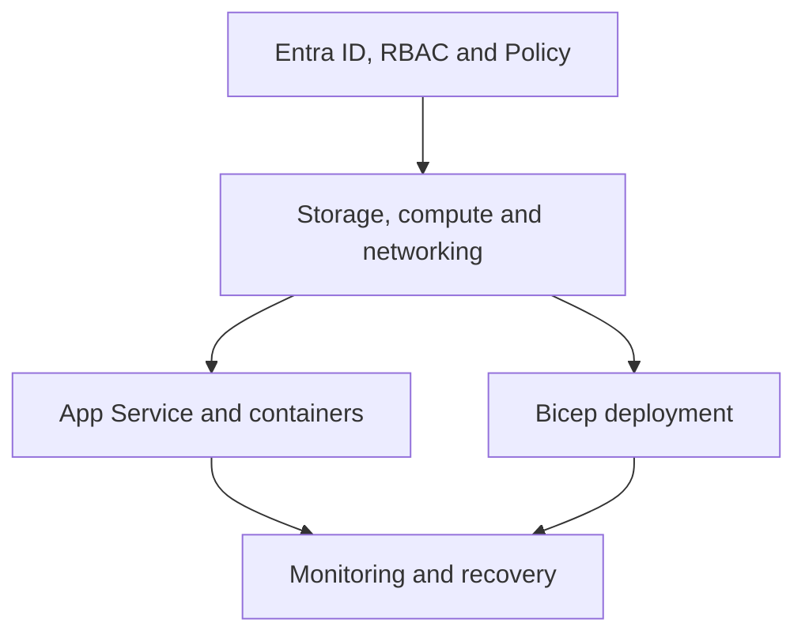

# Nivor Systems — Azure Infrastructure Lab

> A progressive Azure administration project built while preparing for AZ-104. I used a fictional company so that every lab had a reason to exist and every new service had to fit with what I had already built.

## Why I built it

I did not want my Azure preparation to consist only of watching videos and answering certification questions. Those are useful, but they do not force me to choose a subnet range, recover from a denied deployment, explain why a resource exists or clean up something expensive after testing it.

Nivor Systems started as a simple fictional company and grew one implementation at a time. The aim was not to pretend that I had built a production platform. It was to practise the work behind one: identity, permissions, governance, storage, compute, networking, application hosting, containers, monitoring, recovery and Infrastructure as Code.

My strongest technical base is networking, so Azure networking felt familiar at first. The more interesting part was learning how it connects with RBAC, Policy, managed identities, storage, application services and cost control. That is where the project became more than a collection of isolated labs.

## Current status

The planned implementation is now complete across all eight AZ-104 domains. Each module includes the decisions, evidence and limitations from the lab; the final module closes the project with monitoring, alerting and a real VM backup-and-restore test.

| # | Implementation | Status | What it proves |
|---|---|---|---|
| 01 | [Identity & Governance](implementations/01-identity-governance/README.md) | Complete | Entra groups, RBAC, Policy, budgets, tags and Resource Graph |
| 02 | [Azure Storage](implementations/02-storage/README.md) | Complete | Blob, Files, data-plane RBAC, lifecycle rules and data protection |
| 03 | [Azure Compute](implementations/03-compute/README.md) | Complete | Linux VM, managed disks, snapshots, recovery and secure access choices |
| 04 | [Bicep & IaC](implementations/04-bicep-iac/README.md) | Complete | Declarative networking, parameters, Policy enforcement and idempotency |
| 05 | [Azure App Service](implementations/05-app-service/README.md) | Complete | Linux web app, slots, managed identity, swaps and scaling options |
| 06 | [Azure Containers](implementations/06-containers/README.md) | Complete | ACI, Container Apps, ingress, revisions, replicas and autoscaling |
| 07 | [Azure Networking](implementations/07-networking/README.md) | Complete | Hub-and-spoke design, peering, NSGs, private DNS and load balancing |
| 08 | [Monitoring & Recovery](implementations/08-monitoring-recovery/README.md) | Complete | Log Analytics, KQL, alerting and an end-to-end VM backup and restore |

The [implementation log](implementations/CHANGELOG.md) gives a shorter chronological view.

## How I worked

Each phase followed roughly the same loop:

1. Start with a business or operational need.
2. Design the smallest Azure solution that addresses it.
3. Deploy it in my own Pay-As-You-Go lab subscription.
4. Validate what actually works instead of stopping when the portal says the deployment succeeded.
5. Capture evidence and write down the decisions and limitations.
6. Delete resources that are no longer needed so the lab remains affordable.

That last part matters. Several resources shown in the screenshots no longer exist because keeping them running would add cost without adding learning value. The screenshots record the state I created and tested at the time; they are not meant to imply that every service is online simultaneously today.

## The problems taught me more than the happy path

The useful moments were normally the ones where the first attempt did not work.

During the Bicep phase, Azure Policy denied my initial deployment because the virtual network did not contain the required tags. I had to read the error, connect it to the governance rule created earlier and correct the template. That was a better lesson than deploying a template in an empty subscription where nothing challenged it.

The same happened with App Service. A restrictive Policy assignment interfered with the staging slot. Instead of removing governance from the entire subscription, I limited the exception to the lab resource group and documented why it was needed.

Container testing also showed me that resource health and application reachability are different things. A container can be running inside Azure while the HTTP path is still wrong. I therefore checked the service from both the Azure side and the public endpoint.

This is the working habit I want to keep developing: do not restart or rebuild something immediately just because it failed. First inspect the state, narrow down the layer, form a hypothesis and understand the cause. Then fix it and leave the environment clearer than it was before.

## Environment at a glance

The project is organised around a fictional company, but the resources were deployed in a real Azure subscription.



The implementations include:

- Microsoft Entra security groups and group-based Azure RBAC
- subscription governance with Azure Policy, tags, budgets and Resource Graph
- Blob Storage, Azure Files, lifecycle management, soft delete and versioning
- a private Linux VM with managed disks, snapshots and a recovery workflow
- Bicep code for a virtual network and subnet
- a Linux App Service with a staging slot and managed identity
- Azure Container Instances and Azure Container Apps
- hub-and-spoke-inspired networking with peering, tiered NSGs and private DNS
- a Standard Load Balancer configuration
- monitoring, alerting, backup and recovery practice

## Repository structure

```text
.
├── README.md
├── LICENSE
└── implementations/
    ├── CHANGELOG.md
    ├── 01-identity-governance/
    ├── 02-storage/
    ├── 03-compute/
    ├── 04-bicep-iac/
    │   └── bicep/main.bicep
    ├── 05-app-service/
    ├── 06-containers/
    ├── 07-networking/
    └── 08-monitoring-recovery/
```

Each completed module contains its own explanation and evidence. The detailed pages are deliberately more technical than this overview so that someone can either scan the project in a few minutes or follow an implementation more closely.

## What is implemented and what is not

I want the boundaries of the project to be easy to verify.

**Implemented and evidenced:** the Azure resources and configuration shown in the individual modules and screenshots.

**Explored rather than deployed:** some alternatives such as Virtual Machine Scale Sets and private application connectivity. They are discussed because I evaluated them, but they are not presented as completed deployments.

**Configured without end-to-end workload traffic:** the Standard Load Balancer. I created its frontend, backend pool, health probe and rule, but deliberately did not deploy compute backends for that lab. The networking page makes that limitation explicit.

**Not claimed:** production experience, continuous operation, a full disaster-recovery design, or a complete enterprise landing zone. This is a personal learning environment, not a customer or employer environment.

## Technical decisions I would revisit in a larger environment

The lab helped me understand where a small exercise stops and a production design begins. In a larger environment I would consider:

- management groups and separate subscriptions for stronger isolation
- Privileged Identity Management and access reviews
- private endpoints and controlled administrative access through Bastion or VPN
- Log Analytics workspaces with defined retention and alert ownership
- Recovery Services vault policies tested against recovery objectives
- reusable Bicep modules, parameter files and automated validation
- CI/CD with approvals, security scanning and environment separation
- centralized secrets in Key Vault
- documented service-level objectives, incident procedures and rollback plans

These are future design improvements, not features hidden behind the screenshots.

## What I learned

The main result is not the number of Azure resources in the repository. It is that I am now more comfortable moving between layers: checking whether a problem belongs to identity, Policy, networking, the resource configuration or the application itself.

I also became more careful with language. A snapshot is useful, but it is not automatically a complete backup strategy. A green deployment does not prove that users can reach an application. A load balancer without healthy backends does not prove traffic distribution. Writing the documentation forced me to separate those statements.

There is still a lot I want to improve, particularly Linux administration, automation and larger Infrastructure as Code designs. Nivor Systems is the Azure base I am building those skills on rather than a finished claim that I already know everything.

## About me

I am Nicolás Vico Lobato, a junior infrastructure and networking professional based in Zürich. I hold the CCNA and I am preparing for AZ-104 while developing stronger Azure and Linux administration skills.

I built this project to turn certification study into evidence: real configurations, mistakes I had to investigate, decisions I can explain and limitations I am willing to state clearly.
