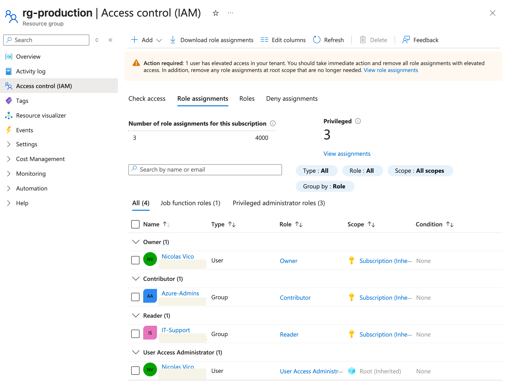
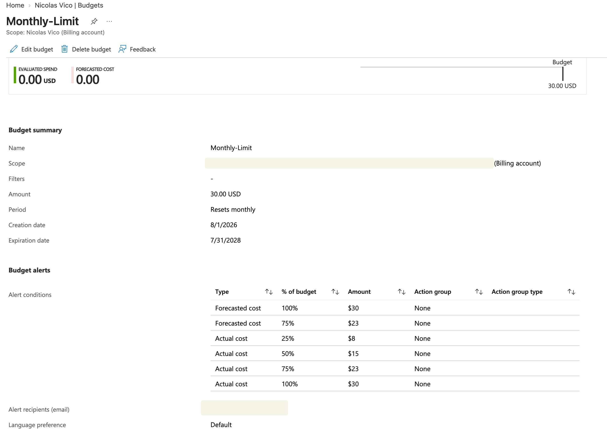
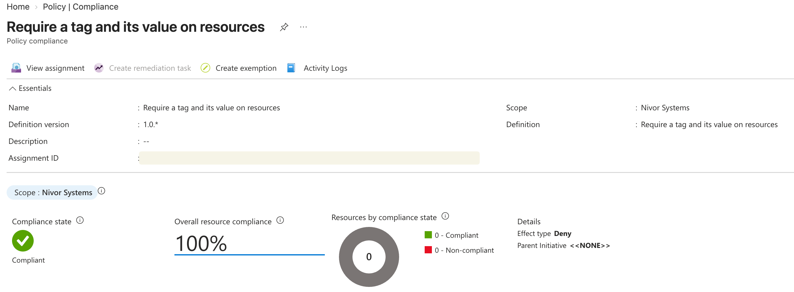
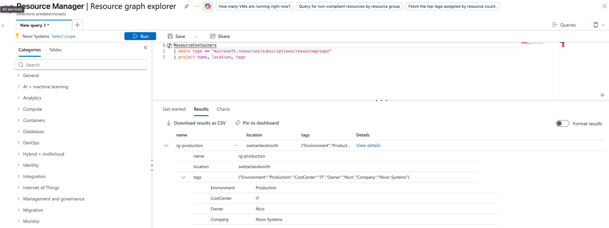
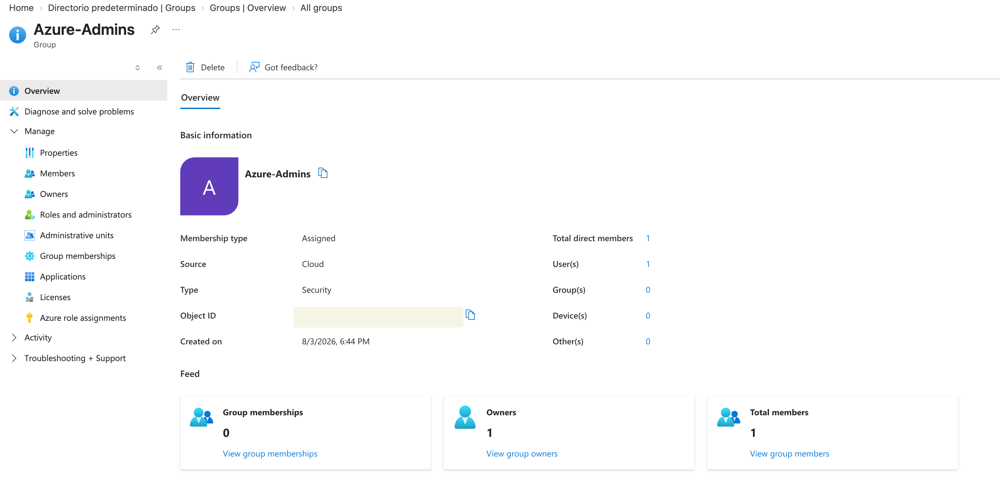
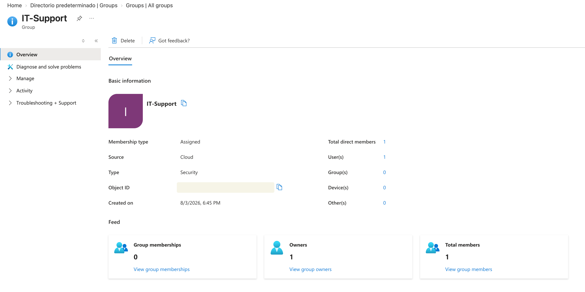

# 01 — Identity & Governance

[Back to the project overview](../../README.md)

I started Nivor Systems with identity and governance because every later resource would inherit decisions made here.

---

## Business scenario

Before deploying the rest of the lab, Nivor Systems needed a consistent identity and governance foundation.

The primary objectives were:

- Centralize identity management.
- Implement Role-Based Access Control (RBAC).
- Establish governance controls.
- Enforce resource tagging.
- Monitor cloud spending.
- Follow the Principle of Least Privilege.

---

## What I configured

The following components were implemented:

- Microsoft Entra ID
- Microsoft Entra Security Groups
- Azure RBAC
- Azure Policy
- Azure Resource Group
- Resource Tags
- Azure Budget
- Azure Resource Graph
- Azure Advisor

---

## Identity design

RBAC permissions are assigned to Microsoft Entra security groups instead of individual users.

| Security Group | Azure Role | Scope | Purpose |
|---------------|------------|-------|---------|
| Azure-Admins | Contributor | Subscription | Manage Azure resources without modifying access permissions |
| IT-Support | Reader | Subscription | Inspect Azure resources without making changes |

This keeps access changes tied to group membership instead of scattering role assignments across individual users.

---

## Governance

The following governance controls were implemented:

- Monthly Azure Budget (USD 30)
- Actual and Forecast budget alerts
- Mandatory resource tagging through Azure Policy
- Standardized resource naming
- Production Resource Group located in **Switzerland North**

---

## Resource classification

Resources are classified using Azure Tags.

Current tags include:

| Tag | Value |
|------|-------|
| Environment | Production |
| Company | Nivor Systems |
| CostCenter | IT |

Azure Resource Graph was used to validate the tagging strategy across the environment.

---

## Microsoft Entra ID

Administrative access is managed using dedicated security groups.

Groups created:

- Azure-Admins
- IT-Support

This design allows administrators to grant or revoke Azure permissions simply by modifying group membership.

---

## Technical decisions

### Contributor instead of Owner

The **Contributor** role was assigned to the Azure-Admins group instead of **Owner**.

This allows administrators to manage Azure resources while preventing them from modifying RBAC assignments.

Only the subscription owner retains Owner permissions.

---

### Group-based access control

RBAC permissions are assigned to Microsoft Entra security groups rather than directly to individual users.

This improves scalability and simplifies permission management as the organization grows.

---

### Subscription scope

Role assignments were configured at the subscription scope because the current environment consists of a single Azure subscription.

In a larger environment with multiple workloads, I would start with narrower scopes, such as resource groups, and widen them only when the responsibility really crosses those boundaries.

---

## Security considerations

The following security principles were applied:

- Principle of Least Privilege
- Separation between identity management and resource administration
- RBAC based on Microsoft Entra Security Groups
- Azure Policy enforcement
- Budget monitoring
- Periodic review of privileged access

---

## Cost management

The governance layer itself generates little or no Azure consumption cost.

A monthly budget of **USD 30** was configured for the Pay-As-You-Go subscription.

Budget alerts notify administrators when spending reaches predefined thresholds.

**Important:** Azure Budgets generate alerts only. They do **not** stop, suspend or delete Azure resources.

---

## Validation

The following configuration was successfully validated:

- Azure-Admins inherits the Contributor role through Microsoft Entra Security Groups.
- IT-Support inherits the Reader role.
- RBAC assignments are applied at subscription scope.
- Azure Policy is assigned and compliant.
- Resource tagging is successfully enforced.
- Budget alerts are configured.
- Azure Resource Graph returns the expected Resource Group inventory.

---

## What I learned

The main lesson was that identity, authorization, compliance and cost controls solve different problems even when they appear together in the same portal:

- Microsoft Entra roles and Azure RBAC roles manage different administrative planes.
- RBAC permissions are inherited through the Azure resource hierarchy.
- Multiple RBAC assignments are cumulative unless a deny assignment exists.
- Azure Policy governs resource compliance.
- Azure RBAC governs authorization.
- Azure Budgets provide visibility into cloud spending but do not enforce spending limits.
- Azure Resource Graph enables fast inventory and governance queries across Azure resources.

---

## What I would change in a larger environment

If this environment were deployed in production, the following improvements would be recommended:

- Implement Microsoft Entra Privileged Identity Management (PIM).
- Require Multi-Factor Authentication (MFA) for privileged accounts.
- Implement Conditional Access policies.
- Reduce RBAC scope wherever possible.
- Enable Access Reviews.
- Enforce naming conventions through Azure Policy.
- Create dedicated Break Glass accounts for emergency access.

---
