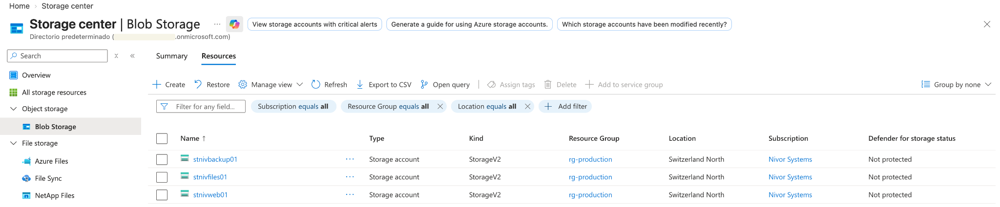
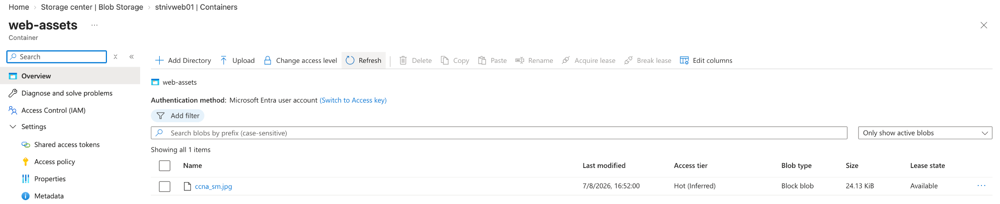
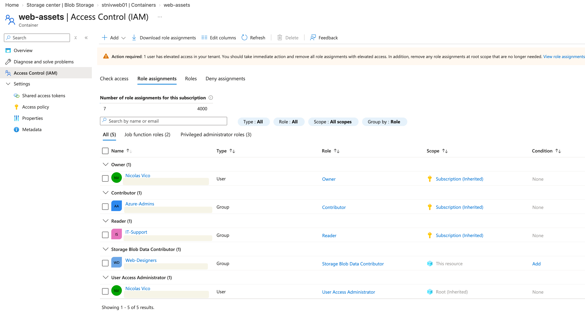
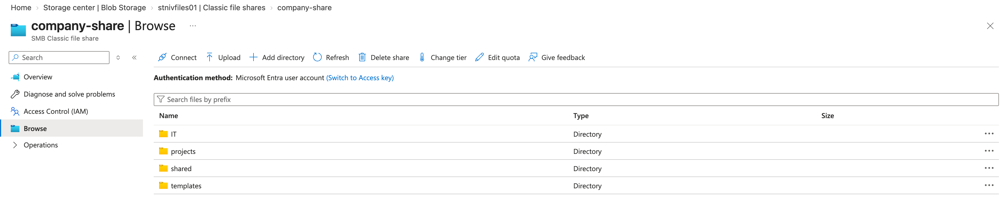
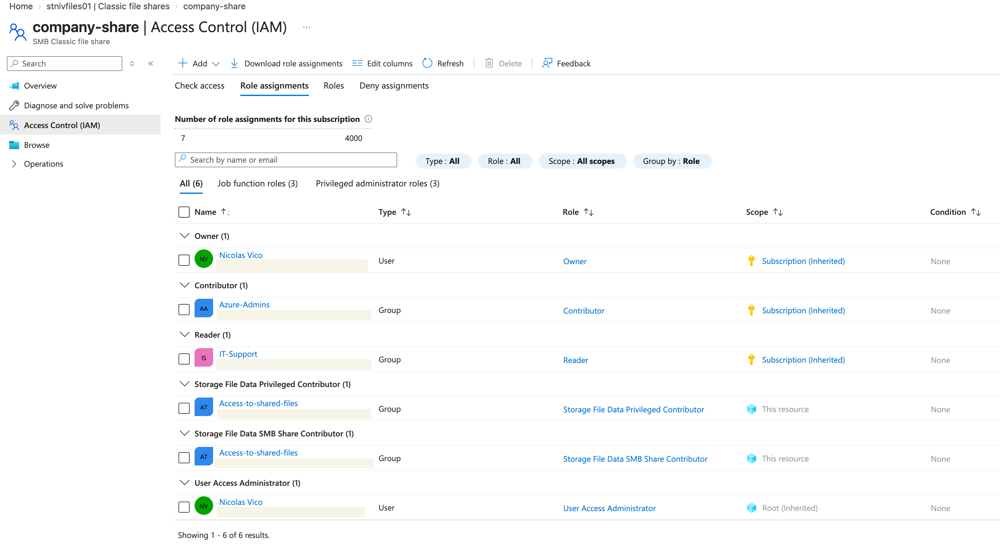
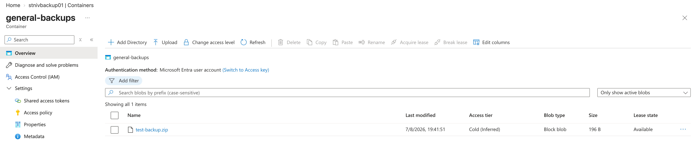
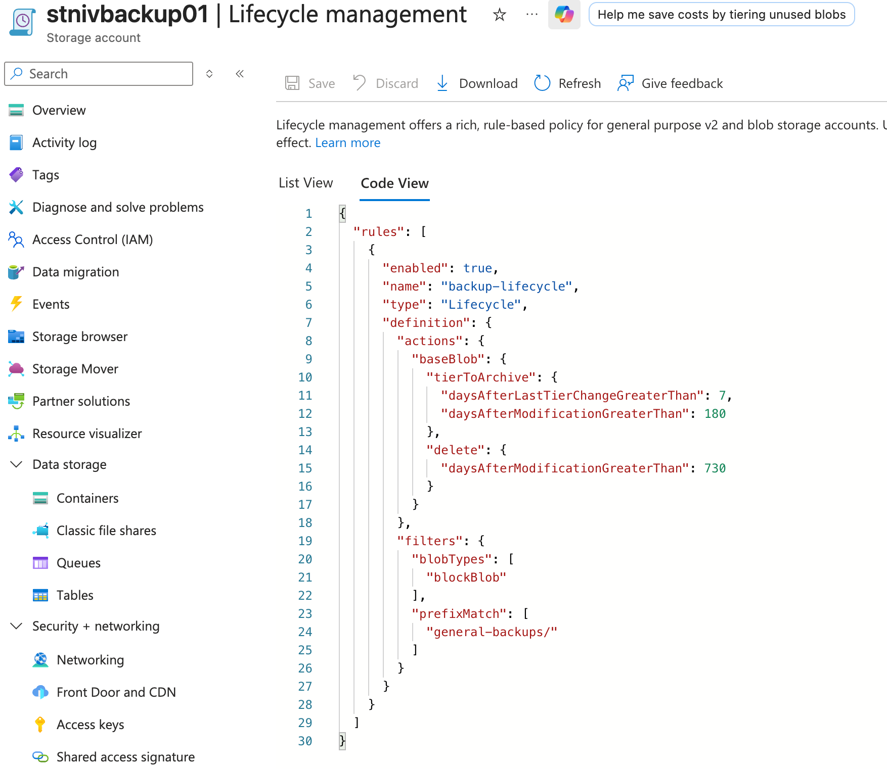

# 02 — Azure Storage

[Back to the project overview](../../README.md)

I used the storage phase to answer a simple question: should three very different workloads share the same account just because they all store data? I separated them into:

- Web application assets
- Internal company file sharing
- Long-term backup storage

Instead of using a single storage account for every workload, separate StorageV2 accounts were deployed to provide clearer workload separation, independent configuration and better security boundaries.

---

## Architecture

| Storage Account | Purpose | Main Resource |
|---|---|---|
| `stnivweb01` | Web application assets | `web-assets` blob container |
| `stnivfiles01` | Internal company files | `company-share` Azure File Share |
| `stnivbackup01` | Long-term backup storage | `general-backups` blob container |

All storage accounts are deployed in:

- Resource Group: `rg-production`
- Region: `Switzerland North`
- Account type: `StorageV2`



---

## 1. Web assets storage

### Objective

Nivor Systems requires centralized object storage for assets used by web workloads.

The storage account:

`stnivweb01`

contains the private Blob Storage container:

`web-assets`



The container was intentionally configured as **Private**.

Anonymous public access is not required. Access to the data should instead be controlled through Microsoft Entra ID and Azure RBAC.

---

### RBAC

A Microsoft Entra security group named:

`Web-Designers`

was granted:

`Storage Blob Data Contributor`

at the **container scope**.



This allows members of the Web-Designers group to read, create, modify and delete blob data without granting unnecessary permissions over the entire storage account.

Keeping the role at container scope let me practise least privilege instead of granting access to the whole account for convenience.

---

## 2. Company file share

### Objective

Nivor Systems requires a centralized file share for internal company documents.

The storage account:

`stnivfiles01`

hosts an Azure Files share named:

`company-share`

The following directory structure was created:

```text
company-share/
├── IT/
├── projects/
├── shared/
└── templates/
```



Azure Files was selected because the workload represents a traditional hierarchical company file system rather than object storage.

---

### Identity and RBAC

A Microsoft Entra security group named:

`Access-to-shared-files`

was created for users requiring access to the company share.

The group received Azure Files data-plane permissions directly at the `company-share` scope.

Assigned roles include:

- `Storage File Data SMB Share Contributor`
- `Storage File Data Privileged Contributor`



Management-plane roles inherited from higher scopes remain separate from the data-plane permissions used to access the actual files.

This distinction is important in Azure:

**Management-plane permissions do not automatically grant access to stored data.**

---

## 3. Backup storage

### Objective

Nivor Systems requires inexpensive storage for backups that are rarely accessed but must remain available for long-term retention.

The dedicated storage account:

`stnivbackup01`

contains:

`general-backups`

A test backup object was uploaded to validate the storage configuration.



The workload uses a lower-cost access tier because frequent access is not expected.

---

## 4. Lifecycle management

Long-term backup data should not remain indefinitely in more expensive storage tiers.

A lifecycle management policy named:

`backup-lifecycle`

was therefore configured.

The policy applies only to block blobs matching:

`general-backups/`

Lifecycle behavior:

| Blob age | Action |
|---|---|
| 0–180 days | Remain in the configured online tier |
| >180 days since modification | Move to Archive |
| >730 days since modification | Delete |



The policy automatically optimizes storage costs without requiring manual movement of old backup objects.

Archived blobs require **rehydration** before normal access, introducing additional retrieval time and cost. Archive storage is therefore appropriate only for data that is expected to be accessed rarely.

---

## 5. Security decisions

Several security decisions were applied across the storage environment.

### Microsoft Entra authentication

Where supported, Microsoft Entra ID authentication is preferred over storage account keys.

This provides identity-based authorization and integrates storage access with Azure RBAC.

### Secure transfer

Secure transfer is required to prevent unencrypted access to storage services.

### Minimum TLS

TLS 1.2 is used as the minimum supported TLS version.

### Anonymous access

Anonymous access is disabled for workloads that do not explicitly require public access.

The `web-assets` container therefore remains private.

### Storage account keys

Shared-key access is avoided where identity-based authentication can be used.

### Encryption at rest

Azure Storage encryption using Microsoft-managed keys is used for the current environment.

Customer-managed keys could be introduced if future regulatory or organizational requirements require Nivor Systems to control the encryption key lifecycle.

---

## 6. Data protection

Storage configuration also considered recovery and accidental deletion.

The lab configuration included:

- Blob soft delete
- Container soft delete
- Blob versioning

These features provide additional protection against accidental deletion or modification.

These mechanisms complement — rather than replace — dedicated backup and lifecycle strategies.

---

## 7. What I practised

This phase gave me hands-on practice with:

- Azure Storage accounts
- StorageV2
- Azure Blob Storage
- Azure Files
- Containers
- File shares
- Access tiers
- Hot / Cool / Cold / Archive concepts
- Lifecycle management
- Microsoft Entra authentication
- Azure RBAC
- Management plane vs data plane
- Least-privilege access
- Storage encryption
- Secure transfer
- TLS configuration
- Soft delete
- Blob versioning
- Long-term retention
- Cost optimization

---

## Result

Nivor Systems now has three storage workloads with clearly separated responsibilities:

```text
Azure
└── rg-production
    │
    ├── stnivweb01
    │   └── web-assets
    │       └── Web-Designers
    │           └── Storage Blob Data Contributor
    │
    ├── stnivfiles01
    │   └── company-share
    │       ├── IT/
    │       ├── projects/
    │       ├── shared/
    │       └── templates/
    │
    └── stnivbackup01
        └── general-backups
            └── Lifecycle Policy
                ├── >180 days → Archive
                └── >730 days → Delete
```

The implementation separates web assets, collaborative file storage and long-term backups while applying identity-based authorization, least privilege, data protection and lifecycle-based cost optimization.
