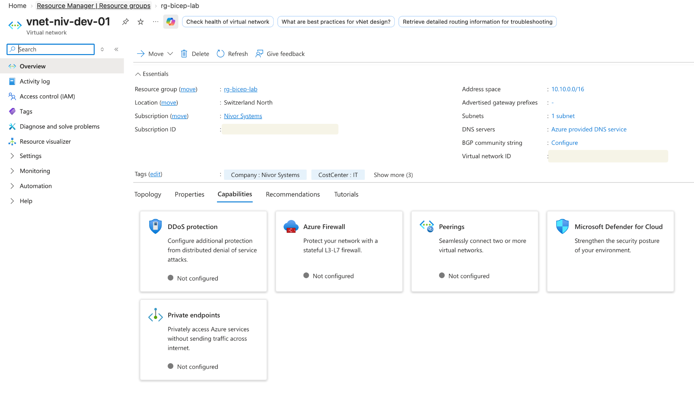
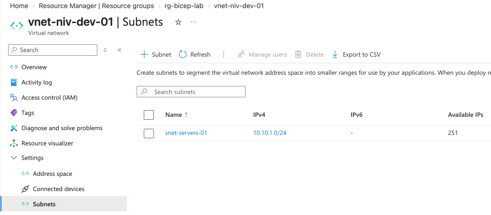

# 04 — Bicep & Infrastructure as Code

[Back to the project overview](../../README.md)

## Overview

After creating several resources through the portal, I wanted to describe one of them as code and see how Azure behaved when the declared state met an existing Policy assignment.

The goal was to replace a manual deployment with a declarative workflow and check parameters, dependencies, Policy enforcement, outputs and idempotency for myself.

## Architecture

```text
Azure Resource Group
└── Virtual Network
    └── Subnet
```

### Resources

| Resource | Configuration |
|---|---|
| Resource Group | `rg-bicep-lab` |
| Region | Switzerland North |
| Virtual Network | `vnet-niv-dev-01` |
| VNet address space | `10.10.0.0/16` |
| Subnet | `snet-servers-01` |
| Subnet prefix | `10.10.1.0/24` |

## Bicep Implementation

The deployment uses:

- **Parameters** for values supplied at deployment time, such as location and environment.
- **Variables** for internally generated resource names and network configuration.
- **Resources** to declaratively define the Azure infrastructure.
- **Parent relationships** to model the subnet as a child resource of the VNet.
- **Outputs** to return the deployed VNet name and resource ID.

The Bicep template is located at:

`bicep/main.bicep`

## Bicep to ARM

The Bicep template was compiled using Azure Cloud Shell:

```bash
az bicep build --file main.bicep
```

This generated the corresponding ARM JSON template and made the deployment flow visible:

```text
Bicep
  ↓
ARM Template
  ↓
Azure Resource Manager
  ↓
Azure Resources
```

## Deployment

The infrastructure was deployed using Azure CLI:

```bash
az deployment group create \
  --resource-group rg-bicep-lab \
  --template-file main.bicep \
  --parameters location=switzerlandnorth environment=dev
```

The deployment successfully created the VNet and its subnet.

## Dependency Management

The subnet was declared using:

```bicep
parent: vnet
```

No explicit `dependsOn` declaration was required.

Bicep inferred the dependency automatically, and the resulting ARM deployment showed the subnet depending on the VNet.

## Azure Policy Integration

The initial deployment was blocked by an existing Azure Policy requiring specific resource tagging.

The Bicep template was updated to include the required governance tags before deployment.

The failure confirmed that Infrastructure as Code deployments remain subject to Azure governance controls:

```text
Bicep deployment
       ↓
Azure Resource Manager
       ↓
Azure Policy evaluation
       ↓
Resource deployment
```

A non-compliant deployment is denied before the resource is provisioned.

## Outputs

The deployment returned:

```text
vnetName
vnetResourceId
```

Bicep outputs expose information from deployed resources for use by other templates, modules or deployment processes.

## Idempotency Test

The same Bicep deployment was executed a second time without modifying the template.

Azure did not create duplicate resources because the existing infrastructure already matched the declared desired state.

Repeating the command helped me check the idempotent behaviour of the declarative deployment.

## Deployment Evidence

### Virtual Network



The deployed VNet uses the `10.10.0.0/16` address space in Switzerland North.

### Subnet



The `snet-servers-01` subnet was successfully deployed with the `10.10.1.0/24` prefix.

## What I practised

- Azure Bicep
- Infrastructure as Code (IaC)
- ARM templates
- Azure CLI
- Azure Cloud Shell
- Parameterization and variables
- Resource dependencies
- Parent/child Azure resources
- Deployment outputs
- Azure Policy integration
- Resource tagging
- Idempotent deployments
- Azure Virtual Networks and subnets

## Cleanup

The lab resources can be removed after validation to avoid retaining unnecessary Azure resources:

```bash
az group delete \
  --name rg-bicep-lab \
  --yes
```
