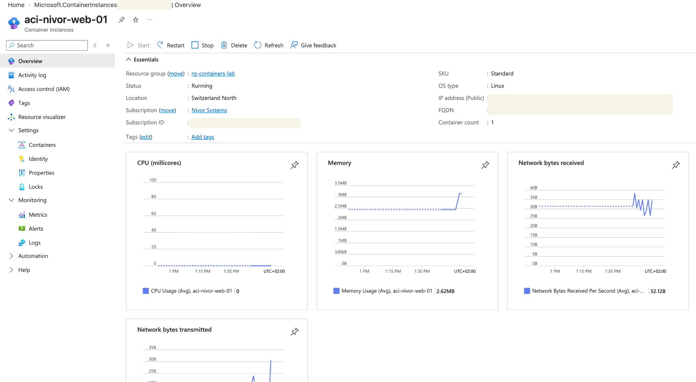
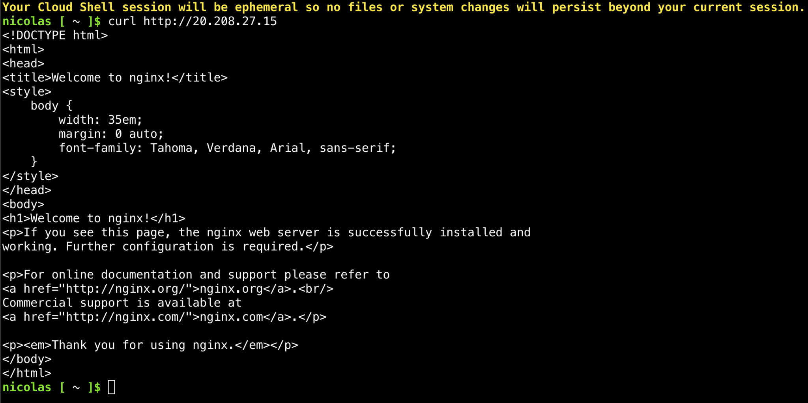
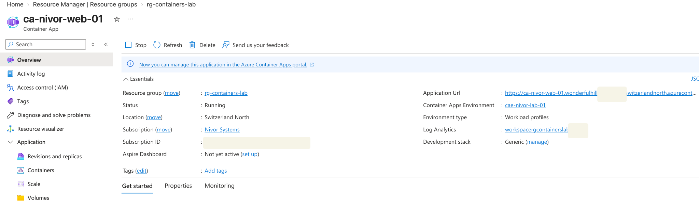
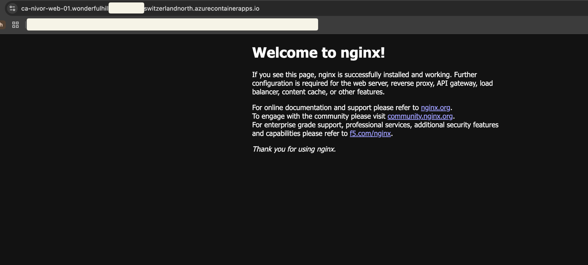
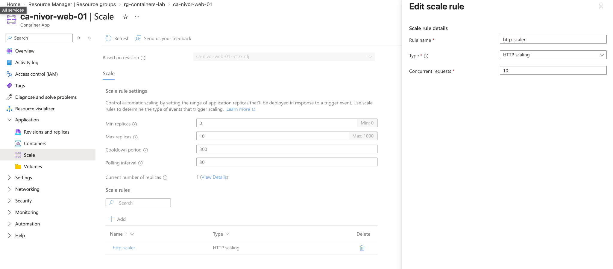
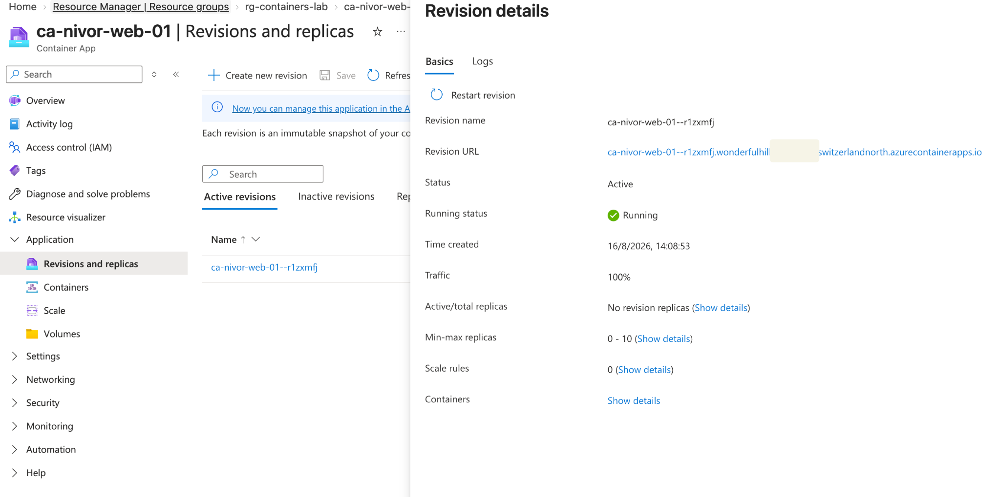

# 06 — Azure Containers

[Back to the project overview](../../README.md)

## Overview

I compared two Azure container services using the same small NGINX workload:

- **Azure Container Instances (ACI)**
- **Azure Container Apps (ACA)**

The point was not the NGINX page itself. I wanted to understand the operational difference between a standalone container in ACI and an application-oriented workload in Azure Container Apps.

An NGINX container was used as the test workload.

The implementation covered:

- Container image deployment
- Public HTTP connectivity
- Container networking
- Runtime validation
- Azure Container Apps environments
- Ingress configuration
- HTTP-based autoscaling
- Revisions and replicas
- Resource monitoring
- Cost-aware resource cleanup

---

## Architecture

```text
                        Internet
                           |
              +------------+-------------+
              |                          |
              v                          v
     Azure Container Instance    Azure Container Apps
        aci-nivor-web-01           ca-nivor-web-01
              |                          |
          Public IP                 HTTPS Ingress
              |                          |
           TCP/80                    Target: 80
              |                          |
              v                          v
            NGINX                      NGINX
                                       |
                                       v
                           Container Apps Environment
                              cae-nivor-lab-01
                                       |
                                  Autoscaling
                                  0–10 replicas
```

All lab resources were isolated inside a dedicated resource group:

`rg-containers-lab`

Region:

`Switzerland North`

---

## Azure Container Instances

### Deployment

The first workload was deployed using **Azure Container Instances**.

ACI provides a simple way to execute containers in Azure without provisioning or managing virtual machines or a complete container orchestration platform.

The deployed instance used:

| Setting | Configuration |
|---|---|
| Container | `aci-nivor-web-01` |
| OS | Linux |
| Image | NGINX |
| Region | Switzerland North |
| Networking | Public |
| Protocol | TCP |
| Port | 80 |

The container successfully entered the **Running** state.



---

### Public connectivity validation

NGINX was first validated from inside the running container using the loopback interface.

```bash
wget -O- http://127.0.0.1:80
```

The returned HTML confirmed that the NGINX process was running and listening on TCP port 80.

External connectivity was then tested against the public IP assigned to the Azure Container Instance.

```bash
curl http://<PUBLIC-IP>
```

The request successfully returned the default NGINX page.



This validated the complete traffic path:

```text
Client
  |
  | HTTP :80
  v
ACI Public IP
  |
  v
Container
  |
  v
NGINX
```

#### Key observation

The container can be healthy internally while still being unreachable externally.

Internal application availability and external network reachability are separate layers that must be validated independently.

---

## Azure Container Apps

The same NGINX workload was then deployed using **Azure Container Apps**.

Unlike ACI, Container Apps provides additional application-platform capabilities such as:

- Managed ingress
- HTTPS endpoints
- Autoscaling
- Revisions
- Replica management
- Traffic management
- Integrated observability

---

### Container Apps environment

A dedicated Container Apps environment was created:

`cae-nivor-lab-01`

The application deployed inside the environment was:

`ca-nivor-web-01`

The environment acts as the execution and security boundary in which Container Apps workloads operate.

The deployment also integrated with Azure monitoring capabilities through Log Analytics.



---

### Ingress configuration

External ingress was enabled for the Container App.

The configuration used:

| Setting | Value |
|---|---|
| Ingress | Enabled |
| Traffic | Accepting traffic from anywhere |
| Ingress type | HTTP |
| Target port | 80 |
| Container service | NGINX |

The important distinction is between the **external application endpoint** and the **container target port**.

```text
Internet
   |
   | HTTPS
   v
Azure Container Apps Ingress
   |
   | Internal forwarding
   v
Target Port 80
   |
   v
NGINX Container
```

Azure Container Apps exposes a managed application URL while forwarding incoming requests to the configured target port inside the container.

---

### Public application validation

The generated Container Apps application URL was opened from an external browser.

The NGINX welcome page loaded successfully, confirming that:

- The container image started correctly
- NGINX was listening on port 80
- External ingress was operational
- The target port was configured correctly
- Azure could route external traffic to the running container



That made the difference clear between directly exposing a container through an ACI public IP and publishing an application through the managed ingress layer provided by Azure Container Apps.

---

### Autoscaling

One of the main capabilities tested with Azure Container Apps was automatic replica scaling.

The application was configured with the following range:

```text
Minimum replicas: 0
Maximum replicas: 10
```

An HTTP scaling rule was configured:

```text
Rule: http-scaler
Type: HTTP scaling
Concurrent requests: 10
```



The scaling model can be represented as:

```text
Incoming HTTP traffic
        |
        v
Concurrent request threshold
        |
        v
   http-scaler
        |
        v
Replica count adjusted
        |
   +----+----+----+
   |    |    |    |
   v    v    v    v
Replica Replica ... Replica
```

With a minimum replica count of `0`, the application is able to scale down when there is no workload.

The maximum of `10` establishes an upper boundary for automatic scaling.

#### Why this matters

ACI primarily executes individual container workloads.

Container Apps adds a managed application layer capable of dynamically adjusting compute capacity according to workload demand.

This makes Container Apps more appropriate for HTTP services and applications with variable traffic patterns.

---

### Revisions and replicas

Azure Container Apps uses **revisions** to represent immutable versions of an application.

The deployed revision was inspected from the Azure portal.

The active revision showed:

```text
Status: Active
Running status: Running
Traffic: 100%
Min replicas: 0
Max replicas: 10
```



A revision represents a snapshot of the application configuration at a particular point in time.

Conceptually:

```text
Container App
     |
     +---- Revision 1
     |
     +---- Revision 2
     |
     +---- Revision 3
```

This architecture enables scenarios such as:

- Application versioning
- Controlled deployments
- Rollbacks
- Traffic splitting
- Blue/green deployment strategies

In this lab, the active revision received **100% of application traffic**.

---

## ACI vs Azure Container Apps

The lab demonstrated that both services can execute containers without requiring direct VM management, but they solve different operational problems.

| Capability | Azure Container Instances | Azure Container Apps |
|---|---|---|
| Run containers without managing VMs | Yes | Yes |
| Simple standalone container execution | Excellent | Possible |
| Public endpoint | Public IP / exposed port | Managed ingress |
| Managed HTTPS application endpoint | Limited | Yes |
| Autoscaling | Limited compared with ACA | Yes |
| Scale to zero | Workload dependent | Yes |
| Revisions | No | Yes |
| Traffic splitting | No | Yes |
| Application-oriented platform | Basic | Yes |
| Operational complexity | Very low | Higher |
| Typical use case | Short-lived/simple containers | APIs, web apps, microservices |

---

## Service selection

### When I would choose Azure Container Instances

ACI is appropriate when the requirement is primarily:

> "Run this container in Azure."

Examples include:

- Temporary workloads
- Simple isolated containers
- Batch-style execution
- Testing container images
- Short-lived automation tasks

The main advantage is simplicity.

---

### When I would choose Azure Container Apps

Container Apps is more appropriate when the requirement becomes:

> "Run and operate this container as an application."

Examples include:

- Web applications
- REST APIs
- Microservices
- Event-driven workloads
- Applications requiring autoscaling
- Applications requiring revision-based deployments

The additional platform features reduce the amount of infrastructure that must be managed manually.

---

## Operational validation

The implementation was validated at multiple layers rather than relying only on the Azure Portal deployment status.

### Container layer

NGINX responded locally inside the container:

```bash
wget -O- http://127.0.0.1:80
```

### Network layer

The ACI workload responded through its public IP:

```bash
curl http://<PUBLIC-IP>
```

### Application layer

The Container App responded through its managed external URL and displayed the NGINX page in a browser.

This layered validation helped distinguish between:

```text
Container process health
        ↓
Port availability
        ↓
Azure network exposure
        ↓
Ingress configuration
        ↓
External application availability
```

---

## Security considerations

Public ingress was intentionally enabled because external connectivity was part of the lab objective.

For production workloads, exposure should be determined by application requirements rather than enabled by default.

Depending on the architecture, additional controls could include:

- Internal-only ingress
- Authentication and authorization
- Managed identities
- Private networking
- Secrets management
- Restricted registry access
- Azure RBAC
- Centralized monitoring

Public exposure in this implementation was therefore a deliberate lab configuration rather than a default production recommendation.

---

## Cost management and cleanup

The implementation was created as a temporary lab environment.

Resources were isolated in:

`rg-containers-lab`

This allowed the entire implementation to be removed after validation without affecting the persistent Nivor Systems infrastructure.

The cleanup included the container workloads and associated Container Apps resources.

This follows an important cloud operations principle:

> Temporary infrastructure should have a defined lifecycle and should be removed when it is no longer required.

Dedicated resource groups make lab cleanup easier and reduce the risk of leaving unused resources generating unnecessary costs.

---

## Key takeaways

The main things I took from the comparison were:

1. A running container does not automatically imply external connectivity.
2. Container health and network reachability should be tested independently.
3. ACI is optimized for simple container execution with minimal infrastructure management.
4. Azure Container Apps adds an application platform around container workloads.
5. Container Apps ingress separates the public application endpoint from the container's internal target port.
6. HTTP-based rules can automatically adjust application replica counts.
7. Scaling to zero can reduce idle compute consumption for suitable workloads.
8. Revisions provide immutable application versions and enable safer deployment strategies.
9. Dedicated resource groups simplify lifecycle management and cost control.
10. Service selection should be driven by workload requirements rather than simply by the fact that an application uses containers.

---

## Evidence

| # | Evidence | Description |
|---|---|---|
| 01 | [ACI Overview](images/01-aci-overview.png) | Running Azure Container Instance and resource configuration |
| 02 | [ACI Public Access](images/02-aci-public-http-validation.png) | External HTTP validation using the ACI public endpoint |
| 03 | [Container App Overview](images/03-container-app-overview.png) | Running Container App, environment and application endpoint |
| 04 | [Container App Public Endpoint](images/04-container-app-nginx-public.png) | NGINX successfully served through managed Container Apps ingress |
| 05 | [Autoscaling](images/05-container-app-autoscaling.png) | HTTP scaling rule and 0–10 replica configuration |
| 06 | [Revision](images/06-container-app-revision.png) | Active Container Apps revision and traffic configuration |

---

## Technologies Used

- Microsoft Azure
- Azure Container Instances
- Azure Container Apps
- Azure Container Apps Environments
- Azure Monitor
- Log Analytics
- Docker container images
- NGINX
- HTTP/HTTPS
- Azure Portal
- Azure Cloud Shell
