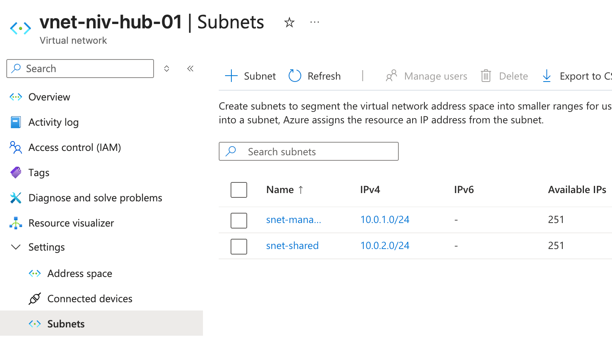
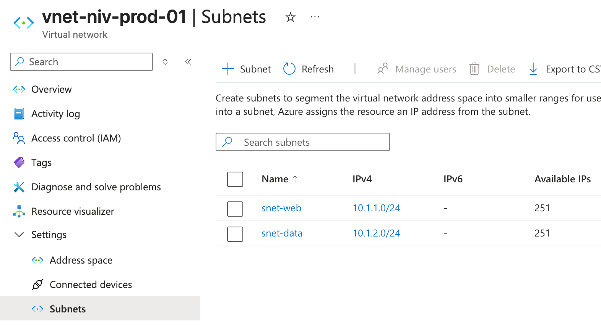
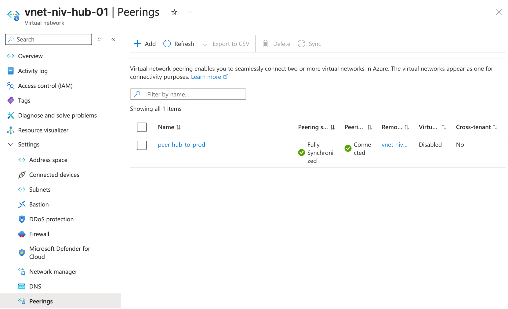
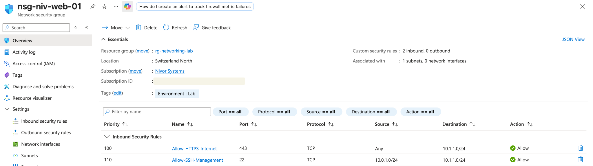
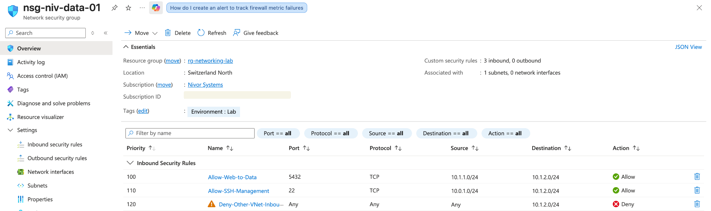
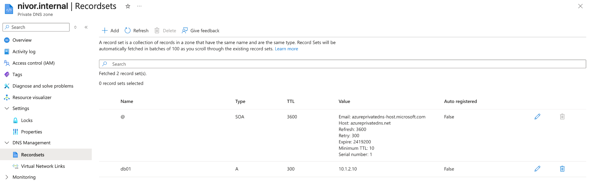
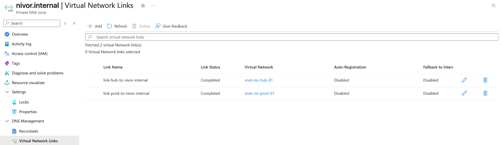
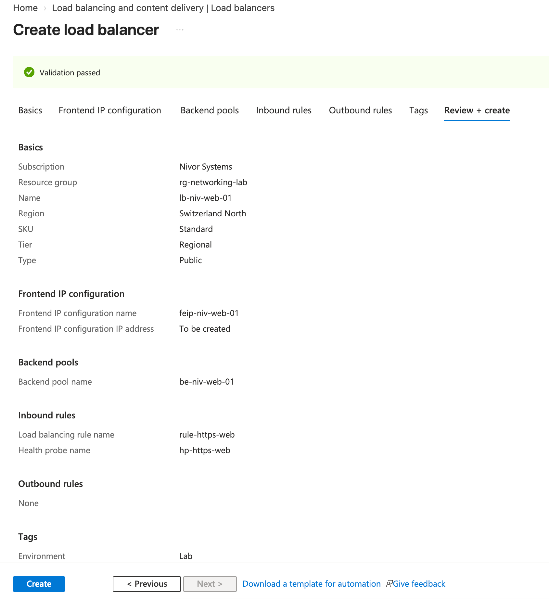

# 07 — Azure Virtual Networking

This implementation builds the network foundation for the Nivor Systems Azure environment.

The objective was to design a segmented Azure network using a hub-and-spoke-inspired architecture, control communication between network tiers with Network Security Groups, provide private DNS resolution, and configure a Standard Azure Load Balancer for the web tier.

The lab focuses on practical Azure networking concepts covered by the AZ-104 exam while applying infrastructure design principles such as segmentation, least privilege, private communication, and controlled traffic flows.

---

## Architecture

The environment uses two main virtual networks:

| Virtual Network | Address Space | Purpose |
|---|---|---|
| `vnet-niv-hub-01` | `10.0.0.0/16` | Shared and management network |
| `vnet-niv-prod-01` | `10.1.0.0/16` | Production workload network |

The networks are connected using Azure VNet Peering.

```text
                         Internet
                            │
                          HTTPS
                           443
                            │
                            ▼
                  ┌─────────────────────┐
                  │ Azure Load Balancer │
                  │    lb-niv-web-01    │
                  └──────────┬──────────┘
                             │
                             ▼
                  ┌─────────────────────┐
                  │      WEB TIER       │
                  │ snet-web            │
                  │ 10.1.1.0/24         │
                  └──────────┬──────────┘
                             │
                       TCP / 5432
                             │
                             ▼
                  ┌─────────────────────┐
                  │      DATA TIER      │
                  │ snet-data           │
                  │ 10.1.2.0/24         │
                  └─────────────────────┘

        vnet-niv-prod-01 — 10.1.0.0/16
                       ▲
                       │
                  VNet Peering
                       │
                       ▼
        vnet-niv-hub-01 — 10.0.0.0/16

              ┌─────────────────────┐
              │ snet-management     │
              │ 10.0.1.0/24         │
              └─────────────────────┘

              ┌─────────────────────┐
              │ snet-shared         │
              │ 10.0.2.0/24         │
              └─────────────────────┘
```

---

## Virtual Networks and Subnets

### Hub Network

`vnet-niv-hub-01` provides the shared network foundation.

Address space:

`10.0.0.0/16`

Subnets:

| Subnet | Address Range | Purpose |
|---|---|---|
| `snet-management` | `10.0.1.0/24` | Administrative and management traffic |
| `snet-shared` | `10.0.2.0/24` | Shared infrastructure and services |



### Production Network

`vnet-niv-prod-01` isolates application workloads from shared infrastructure.

Address space:

`10.1.0.0/16`

Subnets:

| Subnet | Address Range | Purpose |
|---|---|---|
| `snet-web` | `10.1.1.0/24` | Web/application tier |
| `snet-data` | `10.1.2.0/24` | Database/data tier |

Separating the web and data tiers allows security policies to be applied independently to each application layer.



---

## VNet Peering

The hub and production VNets are connected using Azure Virtual Network Peering.

Configured peering:

`peer-hub-to-prod`

The peering provides private connectivity between the address spaces without requiring traffic to traverse the public Internet.

The configured connection reached the following state:

- Peering status: **Connected**
- Synchronization status: **Fully Synchronized**



This allows management resources located in the hub network to communicate with permitted resources in the production network while security remains controlled by NSGs.

---

## Network Security Groups

Network Security Groups were used to implement traffic segmentation between the web and data tiers.

### Web Tier — `nsg-niv-web-01`

The web subnet accepts HTTPS traffic while administrative SSH access is restricted to the management subnet.

| Priority | Rule | Source | Destination | Protocol | Port | Action |
|---:|---|---|---|---|---:|---|
| 100 | `Allow-HTTPS-Internet` | Any | `10.1.1.0/24` | TCP | 443 | Allow |
| 110 | `Allow-SSH-Management` | `10.0.1.0/24` | `10.1.1.0/24` | TCP | 22 | Allow |

This prevents SSH administration from being exposed directly to arbitrary Internet sources.



### Data Tier — `nsg-niv-data-01`

The data tier is more restrictive.

| Priority | Rule | Source | Destination | Protocol | Port | Action |
|---:|---|---|---|---|---:|---|
| 100 | `Allow-Web-to-Data` | `10.1.1.0/24` | `10.1.2.0/24` | TCP | 5432 | Allow |
| 110 | `Allow-SSH-Management` | `10.0.1.0/24` | `10.1.2.0/24` | TCP | 22 | Allow |
| 120 | `Deny-Other-VNet-Inbound` | Any | `10.1.2.0/24` | Any | Any | Deny |

The design allows only the application tier to reach the database service on TCP/5432, while administrative SSH access originates from the dedicated management subnet.

All other inbound traffic to the data subnet is explicitly denied by the custom rule.



### Security Design

The resulting traffic model is:

```text
Internet
   │
   └── TCP/443 ───────────────► Web tier

Management subnet
   │
   ├── TCP/22 ────────────────► Web tier
   └── TCP/22 ────────────────► Data tier

Web tier
   │
   └── TCP/5432 ──────────────► Data tier

Other traffic
   │
   └──────────────────────────► DENY
```

This follows a least-privilege approach: communication is permitted only where required by the architecture.

---

## Private DNS

A private DNS namespace was created for internal service discovery:

`nivor.internal`

A private A record was configured:

| Record | Type | Address | TTL |
|---|---|---|---:|
| `db01.nivor.internal` | A | `10.1.2.10` | 300 |

Applications can therefore reference the database using a stable internal DNS name rather than depending directly on its IP address.



---

## Private DNS VNet Links

The private DNS zone was linked to both virtual networks:

| Link | Virtual Network | Status | Auto-registration |
|---|---|---|---|
| `link-hub-to-nivor-internal` | `vnet-niv-hub-01` | Completed | Disabled |
| `link-prod-to-nivor-internal` | `vnet-niv-prod-01` | Completed | Disabled |

This makes the `nivor.internal` namespace available to resources in both network environments.

Auto-registration was intentionally left disabled because DNS records in this lab are managed explicitly.



---

## Azure Load Balancer

A Standard Public Azure Load Balancer was configured to represent the public entry point for the web tier.

### Configuration

| Component | Configuration |
|---|---|
| Load Balancer | `lb-niv-web-01` |
| SKU | Standard |
| Tier | Regional |
| Type | Public |
| Frontend | `feip-niv-web-01` |
| Backend Pool | `be-niv-web-01` |
| Load Balancing Rule | `rule-https-web` |
| Health Probe | `hp-https-web` |
| Protocol | TCP |
| Frontend Port | 443 |
| Backend Port | 443 |

The load-balancing rule forwards incoming TCP/443 connections to healthy members of the web backend pool.

### Health Probe

The HTTPS health probe checks backend availability on port 443.

Conceptually:

```text
                       ┌── Web backend 01
                       │
Internet ──► LB ───────┤
        TCP/443         │
                       └── Web backend 02
                              ▲
                              │
                         Health Probe
                          HTTPS/443
```

Only healthy backend instances should receive new load-balanced traffic.

No compute instances were deployed as part of this lab. The networking and load-balancing configuration was implemented without creating unnecessary VM resources.



---

## Design Decisions

### Separate Hub and Production Networks

Shared/management infrastructure and production workloads use separate VNets.

This provides a foundation that can later evolve toward a full hub-and-spoke topology.

### Web and Data Segmentation

The production environment separates web and data workloads into different subnets.

This allows independent security policies and reduces unnecessary lateral connectivity.

### Restricted Administrative Access

SSH is not permitted indiscriminately.

Administrative traffic must originate from:

`10.0.1.0/24 — snet-management`

This establishes a dedicated management path.

### Restricted Database Access

The database tier accepts PostgreSQL traffic only from:

`10.1.1.0/24 — snet-web`

This prevents unrelated network segments from directly accessing the database service.

### Private DNS

Internal services use the private namespace:

`nivor.internal`

This decouples service discovery from individual IP addresses and avoids exposing internal DNS records publicly.

### Standard Load Balancer

The Standard SKU was selected to practice the current Azure load-balancing model and provide a foundation for scalable, health-aware application delivery.

---

## Skills Practiced

This implementation provided hands-on experience with:

- Azure Virtual Networks
- IPv4 address planning
- Subnet design
- Hub-and-spoke networking concepts
- VNet Peering
- Network Security Groups
- NSG rule priorities
- Network segmentation
- Least-privilege network access
- Private DNS Zones
- DNS A records
- Virtual Network Links
- Azure Standard Load Balancer
- Frontend IP configurations
- Backend pools
- Health probes
- Load-balancing rules
- Azure resource tagging
- Cost-conscious lab design

---

## Result

The final environment provides a segmented Azure network foundation with:

- dedicated management and production networks,
- isolated web and data tiers,
- private connectivity through VNet Peering,
- controlled inter-subnet communication using NSGs,
- private DNS-based service discovery,
- and a Standard Azure Load Balancer architecture for the web tier.

The implementation demonstrates both AZ-104 networking concepts and the design principles used to build secure and maintainable cloud infrastructure.
