# 08 — Monitoring & Recovery

This was the last implementation in Nivor Systems, and I wanted it to answer two simple questions:

1. If something changes or starts behaving differently, can I see it?
2. If a virtual machine is lost, can I actually bring it back?

Until this point, most of the project had focused on building Azure resources. This module changed the perspective from deployment to operations. I worked with telemetry from a real Storage Account, queried it through Log Analytics, triggered an Azure Monitor alert and then completed a full VM backup-and-restore cycle.

I also kept the parts that did not work on the first attempt. Metrics Explorer remained stuck loading during one of my checks, and the first backup policy was incompatible with the VM configuration. Both problems forced me to inspect what Azure was doing and change the approach instead of treating a green deployment screen as proof that everything worked.

## What I completed

- Created a Log Analytics workspace for the lab.
- Sent Storage Account metrics to the workspace through a diagnostic setting.
- Used KQL to inspect raw records, summarise metrics and isolate transactions.
- Created an Azure Monitor metric alert and an email action path.
- Generated Storage Account activity and verified that the alert fired.
- Protected a private Ubuntu VM with Azure Backup.
- Created a real recovery point in a Recovery Services vault.
- Restored the VM and checked that the original and recovered machines existed side by side.
- Removed the temporary compute, backup and restore resources after collecting the evidence.

## Monitoring path

```text
Storage Account
      ↓
Diagnostic setting
      ↓
Log Analytics workspace
      ↓
KQL validation
      ↓
Azure Monitor alert
      ↓
Email notification
```

The central workspace was `law-niv-monitor-01` in Switzerland North. I used the existing `stnivweb01` Storage Account because it already had a purpose inside the fictional company and could generate simple, understandable telemetry.

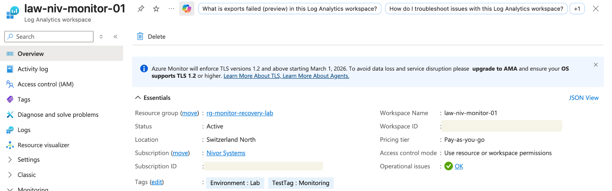

### Sending metrics to Log Analytics

Creating a workspace did not automatically make the Storage Account data appear there. I added a diagnostic setting on `stnivweb01` and sent the available metrics to `law-niv-monitor-01`.

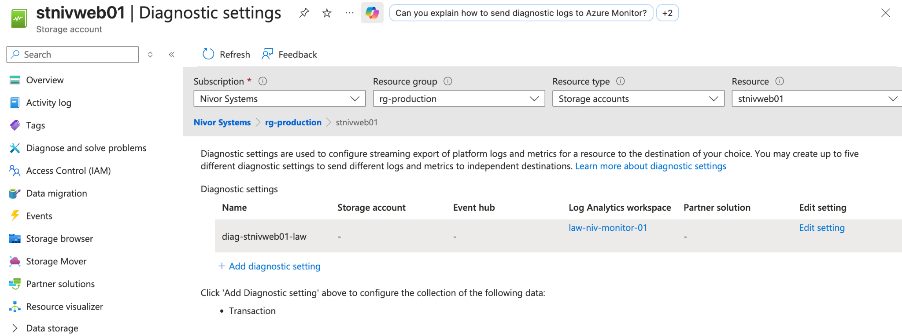

This part also helped me separate two ideas that I had initially mixed together. Azure keeps an Activity Log at subscription level, but that does not mean the `AzureActivity` table is automatically populated in a workspace. Querying subscription activity in Log Analytics requires a subscription-level diagnostic setting that exports it there. Metrics from an individual resource follow their own diagnostic path.

There was also an ingestion delay. An empty query immediately after changing a diagnostic setting was not enough to conclude that the setup was broken, so I waited, generated new activity and checked again.

### Looking at the data with KQL

I started with a broad query because I wanted to see the records before deciding how to aggregate them:

```kusto
AzureMetrics
| where TimeGenerated > ago(1h)
| project TimeGenerated, Resource, MetricName, Total
| order by TimeGenerated desc
```

The result included transactions, ingress and other Storage Account metrics. That confirmed that the diagnostic path was working and that I was querying real ingested data rather than an empty table.

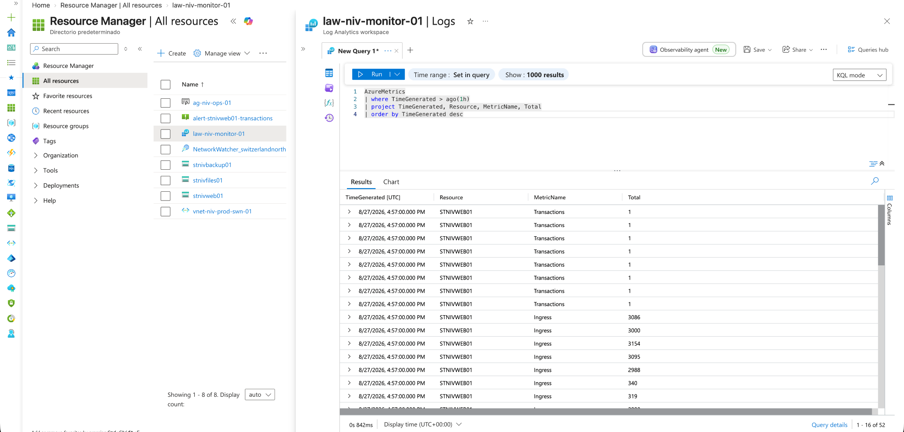

I then grouped the samples by metric name:

```kusto
AzureMetrics
| where TimeGenerated > ago(1h)
| summarize Samples=count(), TotalValue=sum(Total) by MetricName
| order by Samples desc
```

This made the dataset easier to read and showed values for transactions, ingress, egress, availability and latency.

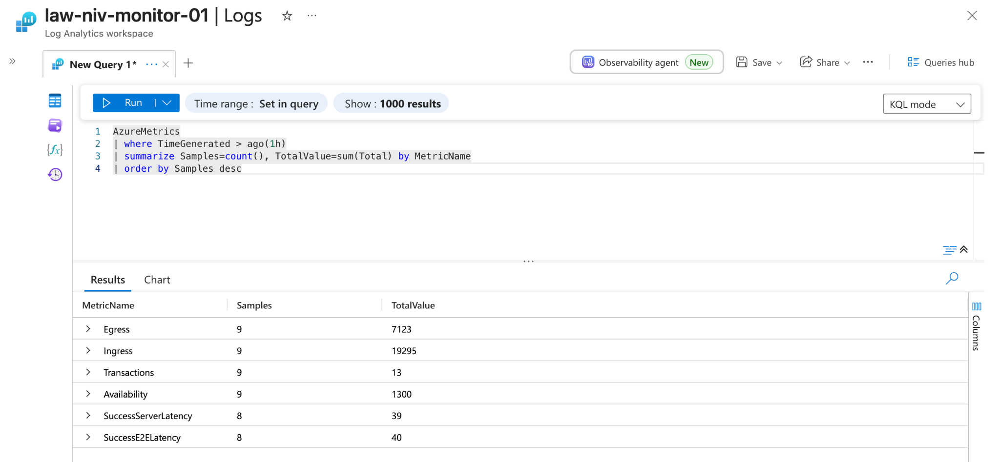

Finally, I isolated transactions into five-minute intervals:

```kusto
AzureMetrics
| where TimeGenerated > ago(1h)
| where MetricName == "Transactions"
| summarize Transactions=sum(Total) by bin(TimeGenerated, 5m)
| order by TimeGenerated desc
```

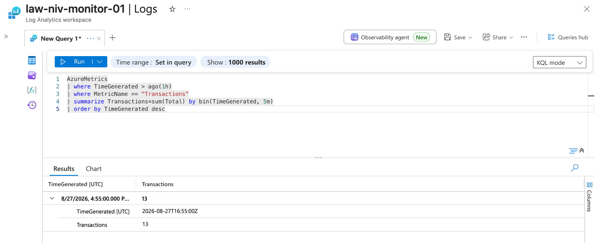

### The check that did not behave as expected

Before using KQL, I tried to validate the transaction metric in Metrics Explorer. The chart kept loading and never gave me a useful result during the lab.

I could have kept clicking around or simply left that part out of the repository. Instead, I treated the portal view as one interface, not as the source of truth. I checked the diagnostic setting, generated more Storage Account activity and queried the ingested records directly in Log Analytics. KQL gave me a clearer way to confirm that the data existed.

That was probably the most useful monitoring lesson in this module: when one view does not give a reliable answer, validate the same path from another layer before changing the whole configuration.

## Alerting and notification

Once I could see transaction data, I created the alert rule `alert-stnivweb01-transactions`. For this short lab, the alert was deliberately configured to trigger when the transaction count was greater than zero. This allowed me to generate activity and verify the complete notification route without waiting for a natural incident.

The alert fired as informational severity after the Storage Account recorded transactions:

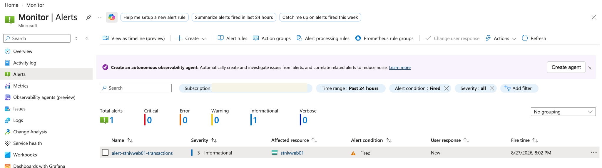

The linked action group delivered the notification by email. The message recorded the affected resource, the evaluated period, a value of 17 transactions and the threshold used for the test.

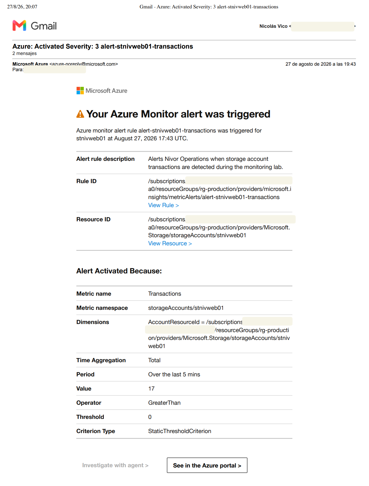

This proves the lab path from resource activity to human notification. It does not prove that a threshold of zero would make sense in production. A real threshold would need a baseline, an owner, an escalation path and enough tuning to avoid noise.

## Backup and restore path

```text
Private Linux VM
      ↓
Enhanced backup policy
      ↓
Recovery Services vault
      ↓
Recovery point
      ↓
Full VM restore
      ↓
Recovered VM
```

For the recovery exercise, I created a temporary resource group named `rg-monitor-recovery-lab` and a Recovery Services vault named `rsv-niv-backup-01`.

The test VM, `vm-niv-backup-test-01`, ran Ubuntu Server 24.04 LTS Gen2 with Trusted Launch. It had no public IP and reused the existing production VNet and server subnet. The VM existed only for the test because keeping that compute size running would add cost without adding more evidence.

### A policy mismatch on the first attempt

I first tried to protect the VM with a Standard backup policy. Azure rejected that combination because the Trusted Launch VM used in the lab required a supported Enhanced policy.

I changed the configuration to `bp-niv-lab-enhanced`, repeated the pre-check and enabled protection. This was a useful reminder that a backup design has to match the workload being protected; selecting a policy name is not enough.

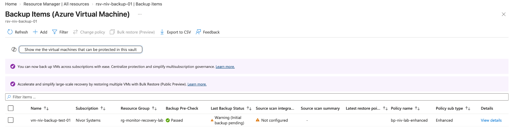

### Creating the recovery point

After protection was enabled, I triggered an on-demand backup. The job completed successfully and Azure created a recovery point with the following properties:

- **Consistency:** File-system consistent
- **Recovery type:** Snapshot and Vault-Standard
- **Protected disks:** All disks

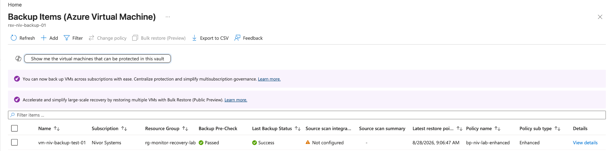

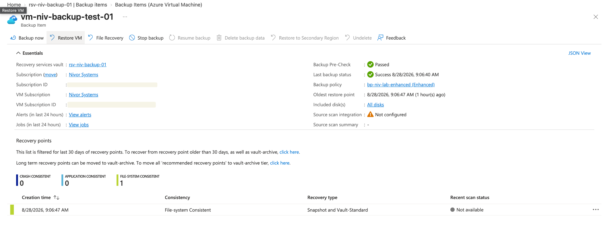

File-system consistent is a precise result, so I am not presenting it as application-consistent. In a larger environment, the required consistency level would depend on the workload and the recovery objective.

### Proving that the VM could be restored

A completed backup job was not enough for me to call the exercise finished. I selected the new recovery point and performed a full VM restore.

The restore job completed in 17 minutes and 22 seconds. The earlier backup job had completed in 27 minutes and 17 seconds.

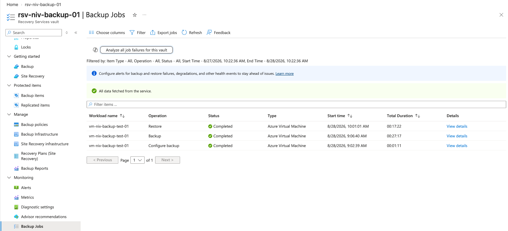

Azure created `vm-niv-backup-restored-01`, and I verified that both the original and restored VMs were present and running at the same time.

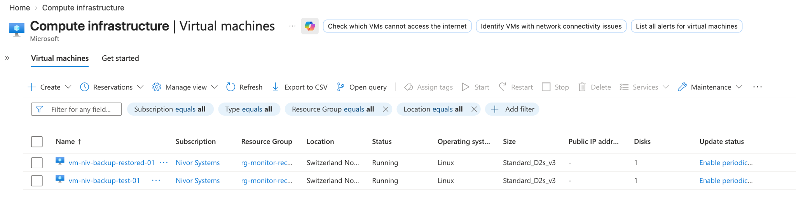

That final check is the evidence I cared about most. A configured policy says that Azure should protect the VM; a recovered VM shows that I followed the restore path to its end.

## Cost and cleanup decisions

This was a disposable learning environment, so I chose settings that were appropriate for a short test rather than pretending they were production defaults:

- The vault used LRS to keep the temporary lab simple and cost-conscious.
- Immutability was disabled because I needed to remove the vault after validation.
- The VM had no public IP.
- Existing network infrastructure was reused.
- The original and restored VMs were kept only long enough to validate the result and capture evidence.
- Backup protection was stopped and backup data was deleted before removing the vault.
- Temporary NICs, disks, VMs and recovery resources were checked during cleanup.

The cleanup mattered because deleting a VM does not automatically remove every possible charge. Managed disks, snapshots, recovery points and backup storage all have their own lifecycle.

## What this module proves — and what it does not

**Implemented and evidenced:** telemetry ingestion, KQL queries, a fired metric alert, email notification, VM protection, an Enhanced backup policy, a real recovery point and a completed full VM restore.

**Lab-specific:** the zero-transaction alert threshold, LRS vault redundancy, disabled immutability and temporary resource lifecycle.

**Not claimed:** production monitoring experience, a complete disaster-recovery strategy, defined RPO/RTO targets, tested application consistency or a mature on-call process.

## What I would add in a production environment

If Nivor Systems became a real environment, the next steps would be operational rather than just adding more Azure services:

- alerts based on measured baselines instead of a demonstration threshold
- service owners, severity rules and escalation procedures
- dashboards and saved queries for recurring investigations
- retention and cost controls for Log Analytics
- Azure Service Health and Resource Health alerts
- backup policies tied to documented RPO and RTO requirements
- scheduled restore tests and a written recovery runbook
- stronger vault protection, including immutability where appropriate
- centralised monitoring across subscriptions and environments

## Final reflection

This module closed the project in the right place for me: not with another successful deployment, but with evidence that I could observe a resource, react when a signal crossed a threshold, protect a VM and recover it.

It also reinforced the way I want to work as a junior infrastructure engineer. I will not know every Azure behaviour in advance. What matters is being able to inspect the state, use more than one source of evidence, change a wrong assumption and explain exactly what was and was not validated.

[Back to the main project README](../../README.md)
